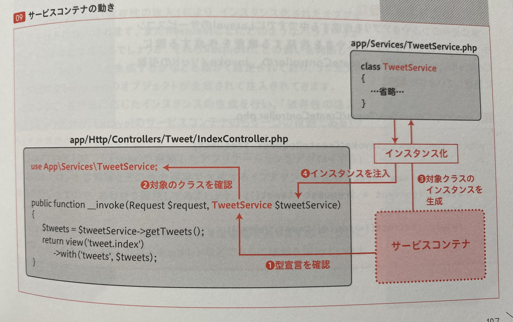

# Laravel サービスコンテナについて

## 参考

- [公式](https://readouble.com/laravel/9.x/ja/container.html)
- [Laravel の構成概念 第 2 回 サービスコンテナ編](https://qiita.com/ucan-lab/items/6f354cf6ae5e807dbada)
  - 概要を理解するための ucan さんによる記事。
- [Laravel の DI コンテナはどう使われているのか](https://blog.fagai.net/2016/09/17/laravel-dependency-injection/)
  - Laravel の DI が内部でどのように実装されているかを解説している記事。難しめ。
- [Laravel の controller の action が呼ばれるまでを覗きたい](https://zenn.dev/shlia/scraps/bb85c4eaeb7f02)
  - 上に同じく内部的な処理をトレースしている。難しめ。

## 始まりの疑問

- なぜ以下の`$request` インスタンスを生成することなくいきなり使えるのか？
- なぜ`$request`は`Request`クラスのインスタンスだと分かるのか？

```php
    public function store(Request $request)
    {
        $name = $request->name;

        //
    }
```

### 答え

- Laravel のサービスコンテナが、`$request`にインスタンスを注入しているから(DI)
  - その際タイプヒンティング（型宣言）が働いている
  - 

## 概要：Laravel サービスコンテナとは

- Laravel のサービスコンテナはクラスの依存関係を管理し、依存注入(DI)を実行するための機能です。
  - イメージとしては、サービス(クラス)を入れておく箱のイメージです。
- サービスコンテナは結合と依存解決という二つの機能があります。
  - **結合**: サービスコンテナにクラスを登録する
  - **依存解決**: サービスコンテナに登録されたクラスのインスタンスを取り出す
    - `make` メソッドを利用して取り出すパターン
    - `DI`を利用して取り出すパターン
      - **特に理由がない限りは DI を使って取り出します。**

## DI(Dependency Injection)とは

Dependency Injection は依存性の注入となります。
抽象クラス(interface)を具象クラスに差し替えて実行できる。

要するにクラスのインスタンス生成処理をサービスコンテナに任せて、クラスの疎結合に保つ仕組みです。
疎結合になっていることでテストの時は DB や外部 API を実際に叩かせないように、プログラム実行時にクラスを差し替えできる。

なかなか簡潔に説明するのは難しく、詳細は DI 関連のオススメ記事を抜粋したので読んだり、ご自身で調べてみてください。

依存性の注入
DI・DI コンテナ、ちゃんと理解出来てる・・？
DI コンテナの本当の使いどころ
PHPerKaigi 2021: 今こそ理解する DI（Dependency Injection） / Sho Yamada

## DI の種類

- コンストラクタインジェクション
- メソッドインジェクション(セッターインジェクション)
- フィールドインジェクション(プロパティインジェクション)
  - PHP では標準実装されていない

DI の種類は 3 つありますが、コンストラクタインジェクションだけで十分なので覚えておきましょう。
Laravel のフレームワーク内で実行されるコントローラのルーティングに対応しているメソッドやコンソールコマンドの handle()メソッドであればメソッドインジェクションを利用できます。(Request クラスなどよく使われます)

## 結合: サービスコンテナにクラスを登録する

結合とはサービスコンテナにインターフェースに対応するクラスを登録することです。
登録自体は次章のサービスプロバイダを使って登録します。

- `bind`
- `singleton`
- `instance`

大きく 3 種類ありますが、特に理由がない限りは `bind` で結合します。
他にもコンテキストによる結合、プリミティブの結合、型指定した可変引数の結合、タグ付け、結合の拡張等ありますが、必要に迫られたら検討してみてください。

### `bind`(バインド、シンプルな結合)

インターフェース名に対応するクラスを登録する。
サービスコンテナから取り出すときに毎回新しいインスタンスを生成する。

### `singleton`(シングルトンの結合)

インターフェース名に対応するクラスを登録する。
サービスコンテナから初めて取り出すときに新しいインスタンスを生成する。
2 回目以降に取り出す時は初回に生成された同じインスタンスが返る。(要は同じインスタンスを使い回しする)

ライフサイクルの記事では、`bootstrap/app.php` で `Kernel` クラスがシングルトン結合されてましたね。

### `instance`(インスタンスの結合)

インターフェース名に対応するインスタンスを登録する。
予め生成したインスタンスをサービスコンテナに登録します。
取り出す時は登録時のインスタンスが返ります。

## 依存解決: サービスコンテナに登録されたクラスのインスタンスを取り出す

依存解決は結合とは反対にサービスコンテナに登録したクラスのインスタンスを取り出すことです。
`make` メソッドを利用して取り出すパターンと自動注入(DI)を利用して取り出すパターンがあります。

**特に理由がない限りは 自動注入(DI) を使って取り出します。**

### 自動注入(DI)

基本はコンストラクタインジェクションを利用します。
Laravel ではメソッドインジェクションやルートモデル結合といった便利機能がありますが、やはりコンストラクタインジェクションだけで良いかなと思います。

### コンストラクターインジェクション

全コントローラの依存を解決するために、Laravel のサービスコンテナが使用されます。これにより、コントローラが必要な依存をコンストラクターにタイプヒントで指定できるのです。依存クラスは自動的に解決され、コントローラへインスタンスが注入されます。

```php
<?php

namespace App\Http\Controllers;

use App\Repositories\UserRepository;

class UserController extends Controller
{
    /**
     * ユーザーリポジトリインスタンス
     */
    protected $users;

    /**
     * 新しいコントローラインスタンスの生成
     *
     * @param  \App\Repositories\UserRepository  $users
     * @return void
     */
    public function __construct(UserRepository $users)
    {
        $this->users = $users;
    }
}
```

### メソッドインジェクション

コンストラクターによる注入に加え、コントローラのメソッドでもタイプヒントにより依存を指定することもできます。メソッドインジェクションの典型的なユースケースは、コントローラメソッドへ `Illuminate\Http\Request` インスタンスを注入する場合です。

```php
<?php

namespace App\Http\Controllers;

use Illuminate\Http\Request;

class UserController extends Controller
{
    /**
     * 新ユーザーの保存
     *
     * @param  \Illuminate\Http\Request  $request
     * @return \Illuminate\Http\Response
     */
    public function store(Request $request)
    {
        $name = $request->name;

        //
    }
}
```

コントローラメソッドへルートパラメーターによる入力値が渡される場合も、依存定義の後に続けてルート引数を指定します。たとえば以下のようにルートが定義されていれば：

```php
use App\Http\Controllers\UserController;

Route::put('/user/{id}', [UserController::class, 'update']);
```

下記のように `Illuminate\Http\Request` をタイプヒントで指定しつつ、コントローラメソッドで定義している id パラメータにアクセスできます。

```php
<?php

namespace App\Http\Controllers;

use Illuminate\Http\Request;

class UserController extends Controller
{
    /**
     * 指定ユーザーの更新
     *
     * @param  \Illuminate\Http\Request  $request
     * @param  string  $id
     * @return \Illuminate\Http\Response
     */
    public function update(Request $request, $id)
    {
        //
    }
}
```

## 公式による利用タイミングの説明

> ### [設定なしの依存解決](https://readouble.com/laravel/9.x/ja/container.html#zero-configuration-resolution)
>
> クラスに依存関係がない場合、または他の具象クラス(インターフェイスではない)のみに依存している場合、そのクラスを依存解決する方法をコンテナへ指示する必要はありません。たとえば、以下のコードを routes/web.php ファイルに配置できます。
>
> ```php
> <?php
>
> class Service
> {
>    //
> }
>
> Route::get('/', function (Service $service) {
>    die(get_class($service));
> });
> ```
>
> この例でアプリケーションの/ルートを訪問すれば、自動的に Service クラスが依存解決され、ルートのハンドラに依存挿入されます。これは大転換です。これは、アプリケーションの開発において、肥大化する設定ファイルの心配をせず依存注入を利用できることを意味します。
>
> 幸いに、Laravel アプリケーションを構築するときに作成するクラスの多くは、**コントローラ、イベントリスナ、ミドルウェアなどの handle メソッドにより依存関係を注入ができます** 設定なしの自動的な依存注入の力を味わったなら、これなしに開発することは不可能だと思うことでしょう。
>
> #### いつコンテナを使用するか
>
> 幸運にも、**依存解決の設定がいらないため、ルート、コントローラ、イベントリスナ、その他どこでも、コンテナを手作業で操作しなくても、依存関係を頻繁にタイプヒントできます。** たとえば、現在のリクエストに簡単にアクセスできるように、ルート定義で Illuminate\Http\Request オブジェクトをタイプヒントできます。このコードを書くため、コンテナを操作する必要はありません。コンテナはこうした依存関係の注入をバックグラウンドで管理しています。
>
> ```php
> use Illuminate\Http\Request;
>
> Route::get('/', function (Request $request) {
>    // ...
> });
> ```
>
> 多くの場合、**自動依存注入とファサードのおかげで、コンテナから手作業でバインドしたり依存解決したりすることなく、Laravel アプリケーションを構築できます**。では、いつ手作業でコンテナを操作するのでしょう？２つの状況を調べてみましょう。
>
> **第１に、インターフェイスを実装するクラスを作成し、そのインターフェイスをルートまたはクラスコンストラクターで型指定する場合は、コンテナにそのインターフェイスを解決する方法を指示する必要があります。**
> 第２に、他の Laravel 開発者と共有する予定の Laravel パッケージの作成の場合、パッケージのサービスをコンテナにバインドする必要がある場合があります。
