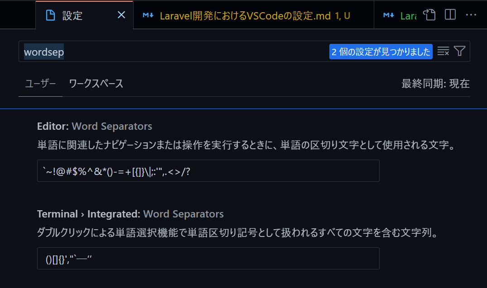
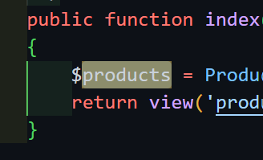
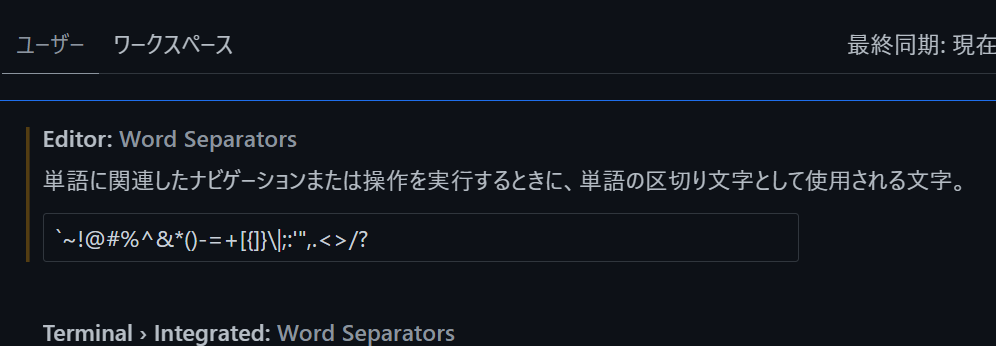
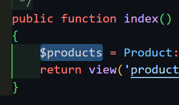

# Laravel 開発における VSCode の設定

## Linter

- `PHPStan`
  - `LaraStan`
- `php code snipher`

## Formatter

### `blade.php`ファイル

- [`Laravel Blade formatter`](https://marketplace.visualstudio.com/items?itemName=shufo.vscode-blade-formatter)
  - [作者ブログ：Laravel blade formatter VSCode Extension を作った](https://www.shufo.dev/posts/published-vscode-blade-formatter/)
  - `PSR-2`準拠

### その他の`php`ファイル

- `php-cs-fixer`
- `PHP Intelephense`
- [`PHP(DEVSENSE)`](https://marketplace.visualstudio.com/items?itemName=DEVSENSE.phptools-vscode)
- [`Laravel Pint`](https://readouble.com/laravel/9.x/ja/pint.html)
  - **まだバグがありそうなので導入は見送る**
  - 詳細は[Laravel Pint](./Laravel%20Pint.md)

### `js`ファイル

- `Prettier`

## 拡張機能

### PHP

#### インテリセンス

- `PHP Intelephense`
- [`PHP(DEVSENSE)`](https://marketplace.visualstudio.com/items?itemName=DEVSENSE.phptools-vscode)

#### `PHP Debug`

### Laravel

#### Laravel Extension Pack

- [公式](https://marketplace.visualstudio.com/items?itemName=onecentlin.laravel-extension-pack)
- 以下の拡張機能が全部入っているので基本的にこれを入れておけばよい

- [`Laravel Blade Snippets`](https://marketplace.visualstudio.com/items?itemName=onecentlin.laravel-blade)
- [`Laravel Snippets`](https://marketplace.visualstudio.com/items?itemName=onecentlin.laravel5-snippets)
- [`Laravel Artisan`](https://marketplace.visualstudio.com/items?itemName=ryannaddy.laravel-artisan)
- [`Laravel Extra Intellisense`](https://marketplace.visualstudio.com/items?itemName=amiralizadeh9480.laravel-extra-intellisense)
- [`Laravel goto view`](https://marketplace.visualstudio.com/items?itemName=codingyu.laravel-goto-view)
- [`Laravel goto controller`](https://marketplace.visualstudio.com/items?itemName=stef-k.laravel-goto-controller)
- [`DotENV`](https://marketplace.visualstudio.com/items?itemName=mikestead.dotenv)
- [`laravel-goto-components`](https://marketplace.visualstudio.com/items?itemName=naoray.laravel-goto-components)
- [`Laravel Blade formatter`](https://marketplace.visualstudio.com/items?itemName=shufo.vscode-blade-formatter)
- [`Laravel Create View`](https://marketplace.visualstudio.com/items?itemName=glitchbl.laravel-create-view)
- [`Laravel Blade Wrapper`](https://marketplace.visualstudio.com/items?itemName=IHunte.laravel-blade-wrapper)

## その他

### `Word Separators`

分かりづらいのでスクショを用いて説明
エディタ上である単語にカーソルを併せて`Ctrl+D`を押すとその単語全体が選択状態になるが、単語に`$`が含まれているときは除外されてします
PHP の変数は`$`を使うのでこの設定では不便
そこで`$`も含めて選択できるようにするのが以下の設定

#### 変更前

#### 変更後

